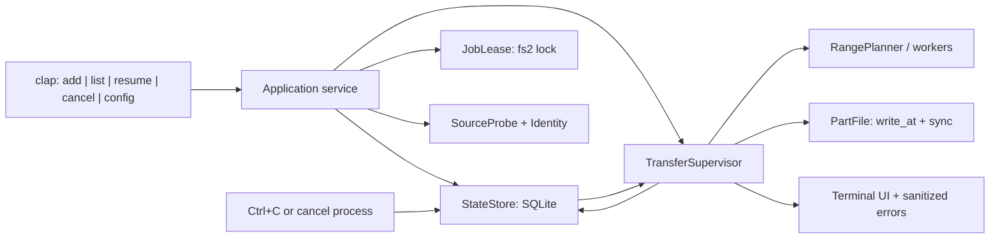
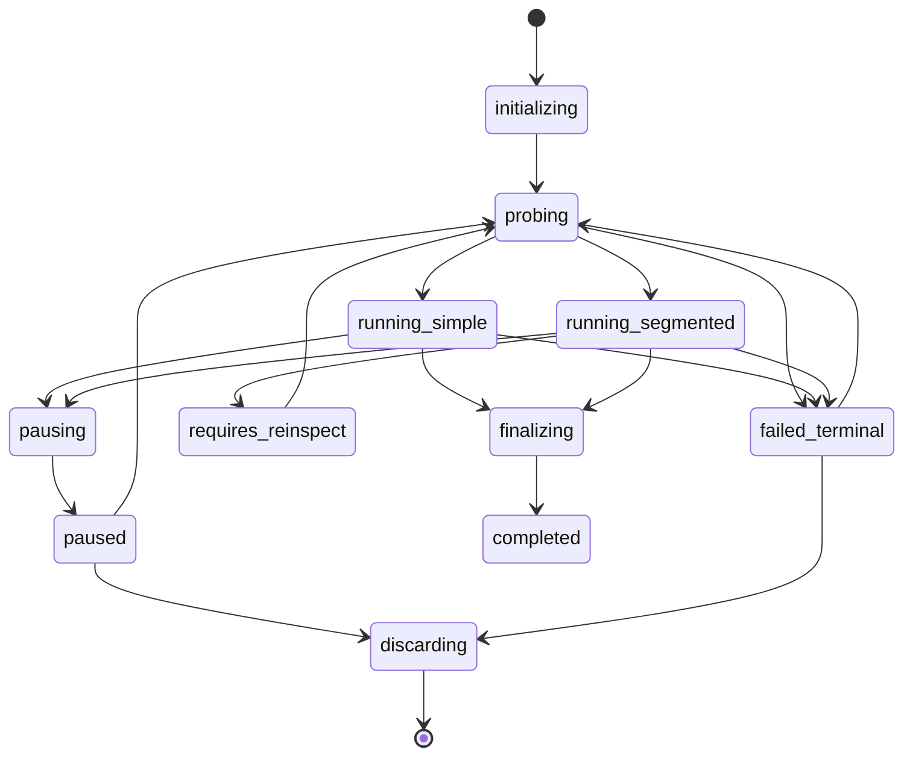

# Arquitetura do MVP — downget

## 1. Escopo e revisão Software Forge

Esta arquitetura implementa somente o MVP definido no [HANDOFF](../HANDOFF.md) e no [PRD](planning/prd-downget-2026-07-26/prd.md). A nota `downget-direcionamento-de` já foi reconciliada no escopo canônico e não adiciona decisões técnicas novas.

O recorte é um único binário Rust para macOS, executado sob demanda no terminal. Um processo que executa `add` ou `resume` é o dono temporário do Job; não há daemon, serviço, fila remota, API local, login, Keychain, navegador ou camada de plugins.

O enquadramento Nirvana-OS/Software Forge é usado como gate de arquitetura: este documento fecha as decisões que o build precisa compartilhar e não adiciona runtime, agente ou integração do Nirvana ao produto.

| Etapa Software Forge | Resultado para o downget |
| --- | --- |
| Discovery e especificação | Encerradas pelo HANDOFF e PRD aprovados. |
| Arquitetura | Este documento fixa as fronteiras que o build não pode reinterpretar. |
| Build | Implementar os módulos, contratos e invariantes abaixo; não ampliar o escopo. |
| Teste | Demonstrar AC-1 a AC-20 no servidor HTTP local e submeter a evidência ao Sentinel. |

## 2. Decisões vinculantes

### AD-1 — Processo único por Job, sem daemon

**Vincula:** um Job em transferência é executado por um único processo CLI que mantém um lease exclusivo.

**Evita:** dois processos gravando o mesmo `.part`, ou uma suposta execução em segundo plano fora do processo que o usuário iniciou.

**Regra:** `add` e `resume` adquirem o lease antes de transferir; `list` apenas lê um snapshot; `cancel` externo pede parada pelo estado e só descarta após observar a parada confirmada.

### AD-2 — Stack pequena e fixada no build

**Vincula:** pin de compatibilidade do MVP efetivamente testado neste ambiente: Rust 1.84; `tokio = 1.43.0` com runtime multithread e sinais; `reqwest = 0.11.27` com `default-features = false`, `rustls-tls`, `stream` e redirects limitados; e `rusqlite = 0.32.1` com SQLite embutido. As demais dependências ficam fixadas pelo `Cargo.lock` testado, sem criar um segundo conjunto de versões nesta arquitetura.

**Evita:** dependência de OpenSSL do macOS, formato caseiro de banco, runtime concorrente alternativo ou abstrações de infraestrutura desnecessárias.

**Regra:** o `Cargo.lock` é versionado e esse conjunto é o pin de compatibilidade do MVP, não uma recomendação de versões mais recentes. Qualquer atualização de Rust, Tokio, reqwest, rusqlite ou de dependência transitiva passa novamente pelos testes locais e pelo Sentinel.

### AD-3 — SQLite local é a única fonte de estado

**Vincula:** `~/Library/Application Support/downget/state.sqlite3` guarda configuração, Jobs, Segmentos, tentativas e controle entre processos; o conteúdo baixado fica somente em `<destino>.part`.

**Evita:** índice global duplicado para arquivos JSON, descoberta frágil de Jobs para `list` e atualização parcial de metadados concorrentes.

**Regra:** usar `journal_mode=WAL`, `synchronous=FULL`, `foreign_keys=ON`, `busy_timeout=5000` e transações curtas `BEGIN IMMEDIATE` para cada mutação. Não há arquivo de estado JSON adicional.

### AD-4 — Ordem de persistência protege bytes confirmados

**Vincula:** o prefixo persistido de um Segmento só avança depois que os bytes foram gravados no offset correto e o `.part` recebeu `sync_data()`.

**Evita:** metadado apontar para bytes que uma queda de energia ainda não tornou duráveis.

**Regra:** o trabalhador grava por offset; a cada 8 MiB ou 1 segundo, e sempre no término/cancelamento, o escritor de estado sincroniza o `.part` e só então confirma `committed_end` em uma transação SQLite. Se houver queda entre essas etapas, bytes extras podem ser baixados novamente, mas nenhum byte ausente é aceito como concluído.

### AD-5 — Range é um protocolo confirmado, não uma dica

**Vincula:** a única prova de segmentação é `GET Range: bytes=0-0` com `206` e `Content-Range: bytes 0-0/<total>` coerente, com `<total>` conhecido.

**Evita:** aceitar corpo de resposta `200` como Segmento, concatenar conteúdo indevido ou finalizar arquivo de uma resposta 416/inconsistente.

**Regra:** `Accept-Ranges` e `HEAD` são apenas metadados. Antes de segmentar, `200` ou total desconhecido descarta o corpo e inicia Transferência Simples do byte zero. Depois de segmentar, `200`, `Content-Range` inválido ou `416` cancela novas requisições de Range, não confirma o corpo afetado e persiste `requires_reinspect` sem arquivo final.

### AD-6 — Identidade antes de reutilização

**Vincula:** Identidade da Fonte é `ETag` forte quando disponível; sem ele, é o par de tamanho conhecido e `Last-Modified` conhecido. Toda retomada e toda URL substituta a compara antes de reutilizar Segmentos.

**Evita:** misturar versões do arquivo em um `.part` existente.

**Regra:** `ETag` fraco não é evidência suficiente sozinho. Sem evidência comparável, o Job preserva o parcial e informa que não pode retomá-lo automaticamente; não reinicia, descarta ou reutiliza bytes silenciosamente.

### AD-7 — URL sensível nunca entra no estado

**Vincula:** uma URL que tenha query, fragmento, userinfo ou cujo destino final redirecionado tenha esses elementos é classificada como efêmera. A classificação não regride dentro do mesmo Job.

**Evita:** persistir uma assinatura, token ou credencial que um detector incompleto não reconheceu.

**Regra:** URL efêmera vive somente na memória do processo. SQLite e logs guardam apenas `replacement_required` e uma redação sem query/fragmento/credencial. Após encerrar o processo, `resume <ID>` sem `--url` falha antes de qualquer requisição. URLs sem esses elementos podem ser retidas para retomada normal; `list` nunca as imprime.

### AD-8 — Lease de arquivo + controle cooperativo

**Vincula:** `~/Library/Application Support/downget/locks/<id>.lock` usa lock exclusivo consultivo de `fs2`; o banco contém `control_seq`, `control_request` e `control_ack_seq`.

**Evita:** `cancel` em segundo processo declarar sucesso antes de o primeiro processo realmente parar, e corrida entre `resume` e `--discard`.

**Regra:** todo comando mutante respeita o lease. O supervisor mantém workers em um `JoinSet`, verifica o controle após cada chunk e no máximo a cada 200 ms, deixa de agendar trabalho, chama `abort_all`, aguarda todos os joins, persiste `paused` e confirma a sequência antes de liberar o lease. O pedido persistido é sempre **pausar**; somente o processo que pediu `--discard`, depois de confirmar a pausa, pode apagar dados.

### AD-9 — Segmentos estáticos e escrita por offset

**Vincula:** o planejador divide tamanho conhecido em `min(concorrência efetiva, ceil(total / 16 MiB))`, nunca menos que um, em intervalos contíguos e não sobrepostos. Cada Segmento grava diretamente no seu intervalo no mesmo `.part`.

**Evita:** concatenar temporários, agendador adaptativo complexo ou segmentos sobrepostos.

**Regra:** para fonte de vários GB e padrão 2, existem dois Segmentos ativos; fontes menores que 16 MiB usam um. Cada resposta de Segmento deve retornar exatamente o intervalo solicitado e o total já confirmado; o contador persistido é o único critério de bytes válidos.

### AD-10 — Retry finito por Segmento/requisição

**Vincula:** cinco tentativas totais, incluindo a primeira, para uma requisição ou Segmento interrompido.

**Evita:** loop infinito, sexta tentativa implícita após reinício e rate limiting agravado.

**Regra:** timeout, erro de transporte transitório, 408, 429 e 5xx usam espera `min(30 s, 500 ms × 2^(tentativa-1))` mais jitter determinístico de 0–250 ms; se houver `Retry-After` válido, a espera é o maior dos dois. A contagem é persistida antes de nova tentativa; ao esgotar, o Job entra em `failed_terminal` com motivo público e acionável.

### AD-11 — Finalização como promoção de arquivo no mesmo diretório

**Vincula:** só a rotina de finalização pode renomear `<destino>.part` para `<destino>`.

**Evita:** arquivo final incompleto, sobrescrita por corrida e promoção antes de SHA-256/tamanho.

**Regra:** sob lease, ela confirma todos os Segmentos, sincroniza o `.part`, valida tamanho quando conhecido e SHA-256 quando esperado, revalida que o destino não existe, faz rename no mesmo diretório e sincroniza o diretório. O banco só vira `completed` depois do rename; na recuperação, `finalizing` com destino existente exige nova validação antes de reconciliar para concluído.

### AD-12 — OneDrive público tem uma única tentativa de compatibilidade allowlisted

**Vincula:** `SourceProbe` reconhece link público `1drv.ms`/OneDrive, acompanha redirects HTTP(S) e, somente em memória, classifica `ithint=file` como item e `ithint=folder` como pasta. A única URL sintética permitida é construída **somente da primeira `Location` HTTPS observada na cadeia** quando seu host for exatamente `onedrive.live.com` e seu path exatamente `/redir`: trocar apenas o path canônico por `/download` e preservar a query original somente em memória. Não há conversão de `Location` posterior, outro host/path nem segunda tentativa sintética; é uma compatibilidade best-effort, não uma API garantida.

**Evita:** tratar landing page HTML como arquivo, transformar uma classificação em autorização, reescrever endpoint arbitrário, gerar ZIP, navegar em pasta ou contornar compartilhamento restrito.

**Regra:** a admissão ocorre antes de `part_file` reservar `.part`. Para item, a resposta à tentativa só prossegue se `Content-Disposition` tiver disposição `attachment` e não for HTML. Para pasta, só prossegue se for `attachment` ZIP verificável por `Content-Type` e/ou filename seguro `.zip` e, quando corpo ou amostra estiver disponível para admissão, por assinatura/conteúdo ZIP coerente. `401`/`403`, HTML, ausência de classificação, host/path fora da allowlist, `Content-Disposition` ausente/conflitante, ZIP não verificável ou outra resposta ambígua encerram sem `.part`. Nenhum caso usa cookies, `Authorization`, OAuth, Graph, Keychain ou bypass; a ação segura é tornar o compartilhamento público/habilitar download e fornecer URL direta do arquivo ou URL pública do ZIP. Query/tokens de toda a cadeia — inclusive os preservados na troca `/redir → /download` — são efêmeros e passam pelo redator da AD-7; o exemplo `ithint=folder` que retorna 403 sem sessão é rejeitado, sem bypass.

## 3. Forma do sistema



### 3.1 Módulos e contratos

| Módulo | Responsabilidade única | Não faz |
| --- | --- | --- |
| `cli` | Parseia os cinco comandos, valida faixa de concorrência e formato de SHA-256; converte erro de domínio em saída/exit code. | HTTP, SQL ou escrita de arquivo. |
| `app` | Orquestra um comando completo e adquire o `JobLease` quando ele muda um Job. | Interpretar cabeçalhos HTTP ou atualizar barras. |
| `config` | Lê/grava `concurrency` global no SQLite; aplica 2 a novos Jobs sem configuração. | Alterar concorrência de Job já criado. |
| `store` | Migra schema, executa transações, expõe snapshots e é o único escritor do estado persistente. | Fazer rede ou decidir retry. |
| `lease` | Cria/abre o arquivo de lock e tenta lock exclusivo não bloqueante. | Guardar estado do Job. |
| `source` | Segue redirects, classifica retenção da URL e `1drv.ms` (`file`/`folder`), executa no máximo a única conversão allowlisted `/redir → /download`, admite `attachment` não HTML/ZIP verificável, coleta metadados e faz a prova de Range. | Persistir URL sensível, reescrever outro endpoint, gerar ZIP, usar cookies/OAuth/Graph/Keychain ou interpretar HTML. |
| `identity` | Normaliza e compara a Identidade da Fonte; produz discrepância pública sem URL. | Decidir se deve descartar parcial. |
| `transfer` | Supervisiona modo simples/segmentado, workers, cancelamento cooperativo, redução de concorrência e retry. | Formatar CLI ou acessar SQL diretamente. |
| `part_file` | Reserva `.part`, faz `write_all_at`, `sync_data`, valida tamanho, SHA-256 e rename final. | Escolher intervalos HTTP. |
| `retry` | Classifica falhas e calcula a próxima espera/categoria terminal. | Dormir sem observar cancelamento. |
| `ui` | Progresso em `stderr`, mensagens acionáveis e redator de todos os valores sensíveis. | Usar valores HTTP crus em mensagens. |

O único fluxo de mutação é `app → store` para transições e `transfer → part_file → store` para confirmação de bytes. Nenhum módulo usa traits genéricas para cliente HTTP, fila, persistência ou scheduler no MVP.

### 3.2 Contratos de CLI

| Comando | Contrato de execução | Resultado observável |
| --- | --- | --- |
| `downget add <URL> [--output …] [--sha256 …]` | Valida HTTP(S), resolve/reserva destino sem sobrescrever, cria Job, inspeciona a Fonte e transfere no processo atual. Para `1drv.ms`, admite antes de criar `.part` somente a tentativa allowlisted de `onedrive.live.com/redir → /download` e resposta de item `attachment` não HTML ou pasta ZIP verificável. | Imprime ID antes do progresso; 0 após finalização, 1 após estado de falha preservado, 2 para argumento/destino inválido ou rejeição de admissão OneDrive. |
| `downget list` | Lê snapshot SQLite sem lease. | ID, destino, estado, progresso se houver e próxima ação; nunca Fonte, token, cookie ou header. |
| `downget resume <ID> [--url …] [--sha256 …]` | Obtém lease, valida checksum sem permitir troca, exige URL nova para `replacement_required`, reinspeciona e valida identidade antes de qualquer byte reutilizado. | Para simples falho, anuncia descarte seguro e reinício do byte zero; para identidade divergente, preserva parcial e retorna erro acionável. |
| `downget cancel <ID> [--discard]` | Pausa Job local ou pede parada ao dono ativo; `--discard` só continua depois de parada e lease confirmados. | Sem flag preserva `.part`/estado. Com flag é irreversível; em timeout de parada, retorna erro e não apaga nada. |
| `downget config set concurrency <1..8>` | Atualiza uma única chave global em transação. | 0 após persistir; valor fora da faixa retorna 2 sem alterar o anterior. |

Erros de domínio usam saída curta em `stderr`, com código e próxima ação. `--verbose`, quando for adicionado, usa o mesmo redator; mensagens de `reqwest` são convertidas para erro interno sem interpolar a URL crua.

## 4. Estado persistente, caminhos e recuperação

### 4.1 Caminhos

```text
~/Library/Application Support/downget/
  state.sqlite3
  state.sqlite3-wal                # transitório do SQLite
  state.sqlite3-shm                # transitório do SQLite
  locks/<job-id>.lock

<diretório escolhido pelo usuário>/
  <nome-final>.part
  <nome-final>                     # somente após finalização
```

O diretório de dados é criado com permissões do usuário atual. O produto não usa Keychain nem grava URL sensível em arquivo temporário, banco, log, nome de lock ou argumento de diagnóstico.

### 4.2 Modelo SQLite mínimo

| Tabela | Campos essenciais | Invariante |
| --- | --- | --- |
| `settings` | `key` (PK), `value`, `updated_at` | Só há `concurrency`; inteiro 1–8. |
| `jobs` | `id`, `dest_path`, `part_path`, `state`, `transfer_mode`, `source_kind?` (`generic`, `onedrive_file`, `onedrive_folder_zip`), `requested_concurrency`, `effective_concurrency`, `parallelism_note`, `url_mode`, `safe_url?`, `source_display`, `size?`, `etag?`, `last_modified?`, `identity_kind`, `sha256_expected?`, `retry_summary`, `last_error_code`, `last_error_action`, `active_run_id?`, `control_seq`, `control_request?`, `control_ack_seq`, timestamps | Não contém URL efêmera, cookies, headers ou tokens. `source_kind` não contém a URL nem parâmetros de redirecionamento. `effective_concurrency` pertence ao Job e sobrevive a redução. |
| `segments` | `job_id`, `ordinal`, `start`, `end`, `committed_end`, `state`, `attempts_used`, `last_error_code` | Intervalos de um Job não se sobrepõem; `start-1 ≤ committed_end ≤ end`; status concluído implica `committed_end = end`. |
| `schema_migrations` | `version`, `applied_at` | Migração é idempotente e transacional. |

`source_display` é apenas esquema/host e caminho sanitizado, sem query, fragmento ou userinfo. `url_mode` é `retained` ou `replacement_required`; o segundo não tem `safe_url` e não pode voltar a `retained` no mesmo Job.

### 4.3 Estados e transições permitidas



`awaiting_url` é uma razão de pausa, não um caminho paralelo: é `paused` com `url_mode = replacement_required` e ação `resume <ID> --url <NOVA_URL>`. `requires_reinspect` preserva todos os bytes e impede finalização; no próximo `resume`, a Fonte é inspecionada de novo. Se ela agora não for segmentável, a CLI avisa, remove o `.part` sob lease e reinicia a Transferência Simples no byte zero.

### 4.4 Escrita atômica e recuperação após queda

1. `add` valida URL/destino e cria uma linha `initializing`. Para o caminho `1drv.ms`/OneDrive, `SourceProbe` conclui a admissão da AD-12 antes de `part_file` criar `.part`; host/path fora da allowlist, 401/403, HTML ou ambiguidade deixam esse arquivo ausente. Depois da admissão, cria o `.part` com criação exclusiva; se uma etapa falhar, remove a linha ainda não ativa e nunca sobrescreve arquivo existente.
2. Todo checkpoint de progresso segue: `write_all_at` → `sync_data(.part)` → transação SQLite que avança somente o prefixo confirmado.
3. Toda mudança de estado, tentativa, identidade, controle ou configuração é uma transação SQLite curta. Escrita de arquivo nunca ocorre dentro da transação.
4. No início de qualquer comando mutante, o recuperador toma o lease. Se ele encontrar `active_run_id` sem lease ocupado, trata o processo anterior como encerrado, preserva os últimos checkpoints e move o Job para `paused`/razão apropriada; não presume que bytes não confirmados existem.
5. A promoção final segue: marcar `finalizing` → validar → rename no mesmo diretório → `fsync` do diretório → marcar `completed`. Recuperação em `finalizing` só marca concluído depois de repetir as validações aplicáveis.

## 5. Coordenação de Job, cancelamento e Ctrl+C

### 5.1 `cancel` de um segundo processo

1. O processo de transferência mantém o `JobLease` e escreve `active_run_id` ao iniciar.
2. `cancel <ID>` encontra lease ocupado, incrementa `control_seq` e grava `control_request = pause`; não espera dentro de transação.
3. O supervisor consulta controle a cada chunk e em no máximo 200 ms. Ele interrompe novas requisições e sleeps de retry, chama `abort_all` no `JoinSet`, aguarda todos os joins, executa checkpoint, grava `paused` e `control_ack_seq`, então libera o lease.
4. O segundo processo observa o ack e adquire o lease. Ele confirma `paused`, `active_run_id = NULL` e a sequência correspondente antes de retornar sucesso.
5. O tempo máximo de confirmação é 10 s. Se expirar, o comando retorna erro acionável e não descarta dados. O pedido de pausa pode ser atendido depois, o que continua seguro.
6. Com `--discard`, depois do passo 4 o mesmo processo marca `discarding`, apaga `.part`, sincroniza o diretório e só então remove Job e Segmentos em transação. Falha de remoção deixa `discard_failed` visível em `list`; nunca há remoção silenciosa de metadados que esconda um parcial restante.

Se o processo dono morrer, o lock do sistema operacional é liberado. Um `cancel` que obtém o lease pode recuperar o estado para `paused` e confirmar a parada; só então um `--discard` poderá remover dados.

### 5.2 Ctrl+C

O primeiro `Ctrl+C` segue o mesmo caminho de pausa, com razão `interrupted`: bloqueia novos workers e retries, cancela I/O, espera checkpoints, grava `paused` e encerra com código 130. Um segundo `Ctrl+C` enquanto a confirmação está em curso apenas informa que a parada segura está sendo concluída; não há atalho que deixe o estado à frente dos bytes duráveis. `SIGKILL` e queda de energia não são interceptáveis, e por isso dependem da ordem de persistência da AD-4.

## 6. Fonte, intervalos, segmentos e retomada

### 6.1 Inspeção e prova de Range

`SourceProbe` permite redirects HTTPS/HTTP até 10 saltos e rejeita esquemas não HTTP(S). Ele coleta cabeçalhos de uma inspeção leve, mas sempre faz a prova:

| Resultado de `GET Range: bytes=0-0` | Decisão |
| --- | --- |
| `206` + `Content-Range` exatamente `0-0/<total>` + total conhecido | Persiste identidade/total, cria Segmentos e inicia modo segmentado. |
| `200` | Fecha/descarta o corpo, persiste `simple` e abre nova requisição sem Range a partir do byte zero. |
| `206` com faixa ou total incoerente | Não aceita corpo; falha como protocolo inseguro e preserva Job. |
| total desconhecido | Não cria Segmentos; fecha/descarta corpo e inicia simples do byte zero. |
| 416 ou outro erro | Não aceita corpo; classifica por retry/erro terminal. |

### 6.1.1 Resolução pública `1drv.ms`/OneDrive

Antes da prova de Range, `SourceProbe` examina a cadeia de redirects somente em memória. Ao identificar `1drv.ms`/OneDrive, lê `ithint=file` ou `ithint=folder` da URL de redirecionamento para definir `source_kind`; a URL completa não sai do módulo `source` nem é gravada. Ausência de `ithint` confiável não é inferida por HTML. A única exceção à regra de não inferir endpoint é: a **primeira `Location` HTTPS observada na cadeia**, e somente ela, com host exato `onedrive.live.com` e path exato `/redir`, pode gerar uma única requisição a `https://onedrive.live.com/download` com a mesma query ainda apenas em memória. Redirects posteriores podem ser seguidos como redirects HTTP normais, mas nunca reescritos; não há segunda URL sintética.

| Situação de admissão | Decisão |
| --- | --- |
| Primeira `Location` HTTPS é `onedrive.live.com` + `/redir`; `ithint=file`; resposta tem `Content-Disposition: attachment` e não é HTML | Faz a única tentativa `/redir → /download` e, se admitida, segue para inspeção normal e prova de Range/Transferência Simples. |
| Primeira `Location` HTTPS é `onedrive.live.com` + `/redir`; `ithint=folder`; resposta é `attachment` ZIP verificável por tipo/filename e, quando aplicável, conteúdo ZIP | Faz a única tentativa `/redir → /download`, trata o ZIP como Fonte de um arquivo e segue para inspeção normal. |
| Primeira `Location` HTTPS tem host/path diferente, ou uma `Location` posterior seria a candidata | Falha sem converter endpoint, sem segunda tentativa e antes de criar Arquivo Parcial. |
| `text/html`/landing page, `Content-Disposition` ausente ou conflitante, ZIP não verificável ou outra resposta ambígua | Rejeita antes de criar Arquivo Parcial ou transferidor; pede URL pública direta do arquivo ou do ZIP. |
| 401/403, compartilhamento restrito ou download bloqueado | Rejeita antes de criar Arquivo Parcial, sem retry autenticado, cookie, OAuth, Graph ou Keychain; pede tornar o compartilhamento público/habilitar download e fornecer URL adequada. |

O caso conhecido em que o redirect traz `ithint=folder` e a resposta final é 403 sem sessão cai na última linha: o marcador permite explicar que se trata de pasta, mas não autoriza acesso nem fallback.

Em um worker segmentado, cada resposta precisa ser `206`, ter intervalo e total exatamente iguais ao solicitado e, quando `Content-Length` existir, tamanho igual ao intervalo. Corpo curto, longo ou inválido não atualiza `committed_end`. `200`, `Content-Range` inválido e `416` depois de segmentar produzem `requires_reinspect`, preservam `.part` e não fazem fallback automático na mesma execução.

### 6.2 Planejamento e paralelismo

O tamanho é particionado uma vez no início; workers não roubam intervalos nem criam arquivos por Segmento. A concorrência solicitada vem de `settings` na criação do Job; `effective_concurrency` começa igual a ela e não é alterada por `config set` posterior.

Se, com mais de uma requisição de Range em voo, a Fonte retornar 429 ou 503, o supervisor persiste `parallelism_note = reduced_after_429_or_503`, fixa `effective_concurrency = 1`, mostra a ação ao usuário e deixa concluir/retentar os intervalos a partir de seus últimos checkpoints. Não inicia novos workers paralelos. Isso fornece a redução verificável de AC-19 sem tentar adivinhar uma capacidade ótima do servidor.

### 6.3 Identidade e URL substituta

Antes de retomar, `SourceProbe` obtém os mesmos metadados e `identity` compara:

1. `ETag` forte igual, quando ambos disponíveis; ou
2. na falta de ETag forte, tamanho conhecido igual **e** `Last-Modified` conhecido igual.

Uma divergência, ausência de evidência comparável ou URL efêmera sem `--url` bloqueia antes de abrir o `.part` para escrita. Uma URL substituta compatível conserva os checkpoints; uma incompatível deixa o Job e parcial intactos, com instrução de descartar explicitamente ou iniciar outro Job. URL efêmera recebida por `add` ou redirect não é reconstituída de estado após reinício, mesmo se o último erro não foi 403.

### 6.4 Transferência simples

Transferência Simples não registra segmentos nem tenta Range para retomar. Quando falha definitivamente, mantém `.part` e Job. Em `resume`, sob lease, a CLI comunica que o parcial será descartado, remove-o com segurança, cria novo `.part` e inicia do byte zero. Nenhum contador de bytes antigo é reutilizado.

## 7. Integridade, retry, privacidade e UX

### 7.1 Retry e erros

| Classe | Ação |
| --- | --- |
| timeout, erro transitório de transporte, 408, 429, 5xx | Retry pelo orçamento de cinco, com espera cancelável e `Retry-After`. |
| 403 em Fonte efêmera | Pausa como `awaiting_url`; informa `resume <ID> --url <NOVA_URL>` sem imprimir a URL. |
| `1drv.ms`/OneDrive com 401/403, HTML, host/path fora da allowlist, `attachment` ambíguo, ZIP não verificável, acesso restrito ou download bloqueado | Falha segura antes de `.part`, sem segunda URL sintética nem cookies/OAuth/Graph/Keychain/bypass; informa URL pública direta do arquivo ou URL pública ZIP da pasta, conforme `source_kind` quando disponível. |
| 4xx não recuperável | Falha terminal preservada; sem retry automático. |
| 200/Content-Range inválido/416 no worker de Range | `requires_reinspect`; nenhum byte da resposta é aceito. |
| checksum ou tamanho inválido | `failed_terminal`; `.part` e metadados ficam para diagnóstico/descarte explícito. |

`Retry-After` aceita delta-seconds ou data HTTP válida. Toda espera observa o token de cancelamento e a mudança de controle; não há sleep que atrase uma pausa além do checkpoint em curso.

### 7.2 Redação obrigatória

- Nunca registrar URL crua efêmera, query, fragmento, userinfo, `Authorization`, `Cookie`, `Set-Cookie` ou cabeçalho de autenticação.
- O valor de `ithint` pode orientar `source_kind`, mas a URL de redirecionamento `1drv.ms`/OneDrive — inclusive a query copiada somente em memória na tentativa `/redir → /download` — e seus tokens nunca entram em SQLite, `list`, logs ou mensagens.
- Redator é aplicado na entrada de logs, erros HTTP, persistência e renderização de `list`; não depende de cada chamador lembrar de esconder um campo.
- Headers usados na identidade são extraídos para campos específicos (`ETag`, tamanho, data) e o conjunto completo de headers não é persistido.
- Progresso usa `stderr`; `stdout` fica reservado a saídas estáveis que podem ser automatizadas no futuro, sem valores sensíveis.

### 7.3 Finalização e nome

`--output` tem precedência. Nome derivado de `Content-Disposition` só é aceito se for um nome de arquivo simples após remover separadores, controle, `..`, nomes vazios e caminhos absolutos; caso contrário, o fallback é `download-<id>`. A criação exclusiva do `.part` protege o início; a rechecagem do destino imediatamente antes do rename protege a promoção.

## 8. Plano de testes local — AC-1 a AC-20

O build deve ter um servidor HTTP local de fixture, controlado por cenário, e testes de integração que invoquem o binário em diretórios temporários. O fixture registra métodos, ranges, simultaneidade, atrasos, redirects e corpos enviados; ele simula `1drv.ms`/OneDrive sem serviço externo.

| AC | Cenário local e asserção de arquitetura |
| --- | --- |
| AC-1 | `direct_range_download_writes_the_final_file_after_a_valid_proof`: 206 válido, dois ranges distintos e promoção final. |
| AC-2 | `a_200_range_probe_falls_back_to_a_single_simple_download` e `simple_resume_announces_discard_and_restarts_at_byte_zero`: fallback e reinício seguro. |
| AC-3 | `sigint_then_resume_uses_only_the_durably_missing_range`: SIGINT, `committed_end` e Range de retomada exato. |
| AC-4 | `resume_without_etag_uses_size_and_last_modified_and_rejects_a_changed_date`: identidade sem ETag forte e bloqueio antes de escrita. |
| AC-5 | `replacement_url_with_matching_identity_resumes_a_preserved_segmented_job` e `divergent_replacement_url_blocks_and_preserves_the_partial`. |
| AC-6 | `probe_retries_transport_408_and_5xx_before_confirming_range`, `probe_retries_429_before_confirming_range` e `a_transient_simple_transfer_failure_is_retried`. |
| AC-7 | `sigint_pauses_durably_and_returns_exit_130`: exit 130, `.part` preservado e Job pausado. |
| AC-8 | `checksum_and_global_concurrency_cli_contracts_are_persistent` e `checksum_mismatch_fails_finalization_and_preserves_partial`. |
| AC-9 | `checksum_and_global_concurrency_cli_contracts_are_persistent`: persistência de 1/8 e rejeição de valor inválido. |
| AC-10 | `signed_url_is_not_written_to_sqlite_or_printed` e `sensitive_url_and_response_headers_never_reach_output_or_sqlite`. |
| AC-11 | `forbidden_signed_source_pauses_without_leaking_its_url`. |
| AC-12 | `app::tests::cancel_preserves_then_explicitly_discards_partial` e `second_process_cancel_acknowledges_pause_before_discarding`. |
| AC-13 | `unsafe_content_disposition_uses_download_id_fallback_and_never_overwrites_it` e `existing_output_is_never_overwritten`. |
| AC-14 | `interrupted_signed_url_is_not_persisted_and_resume_requires_a_replacement_without_network`. |
| AC-15 | `second_process_cancel_acknowledges_pause_before_discarding`. |
| AC-16 | `unknown_range_total_falls_back_to_simple_without_promoting_probe_data`, `worker_200_after_valid_proof_stops_without_final_file` e `post_proof_416_and_invalid_content_range_require_reinspection`. |
| AC-17 | `retry_exhaustion_persists_and_resume_never_sends_a_sixth_simple_request` e os cenários de `Retry-After` 429/503. |
| AC-18 | `list_covers_all_job_states_with_safe_next_actions_and_no_source_leak`. |
| AC-19 | `parallel_429_reduces_concurrency_and_is_visible_in_list` e `parallel_503_reduces_concurrency_waits_and_persists_the_list_note`. |
| AC-20 | Fixture simula que a **primeira `Location` HTTPS** é `onedrive.live.com/redir` com query sentinela: somente uma requisição sintética `/download` é feita, sem persistir/imprimir a query. Para `ithint=file`, aceita apenas `Content-Disposition: attachment` não HTML; para `ithint=folder`, aceita apenas `attachment` ZIP verificável por tipo/filename e, quando aplicável, conteúdo ZIP. Depois simula 401/403, HTML, host/path fora da allowlist e resposta ambígua; nenhum cria `.part`, gera segunda URL sintética ou usa cookies/OAuth/Graph/Keychain/bypass, e toda URL com query/token permanece ausente de estado, saída e logs. |

Ordem mínima de implementação/teste: (1) schema, CLI e fixture; (2) simples + checkpoints + SIGINT; (3) prova de Range e Segmentos; (4) identidade, URL efêmera, cancelamento entre processos e descarte; (5) resolução pública `1drv.ms`/OneDrive, finalização/SHA-256, privacidade e matriz AC completa. Antes do handoff de código, o Sentinel deve receber os resultados de `cargo test`, a matriz AC preenchida e a evidência de que não há token sentinela nos artefatos gerados.

## 9. Riscos de implementação a tratar no build

| Risco | Regra para o construtor |
| --- | --- |
| Ordem errada entre `write_at` e SQLite | Nunca avance `committed_end` sem `sync_data`; bytes redundantes são aceitáveis, bytes imaginários não. |
| Lock advisory ignorado por um comando | Toda mutação de Job passa por `JobLease`; `list` é a única operação sem lease. |
| Cancelamento ativo removendo cedo | `--discard` não é gravado como ordem autônoma; ele só apaga no processo solicitante após ack e lease. |
| Resposta 200 consumida como Range | Descartar corpo da sonda; após segmentação, não fazer fallback automático no mesmo processo. |
| `ETag` fraco ou identidade incompleta | Não usar como autorização para reaproveitar Segmentos. |
| URL em mensagem de biblioteca | Sanitizar na borda de `source`/`ui`; testes AC-10 e AC-18 usam valor sentinela. |
| Compatibilidade OneDrive confundida com API/autorização | Reescrever somente a primeira `Location` HTTPS com host exato `onedrive.live.com` e path exato `/redir`, uma vez e em memória; exigir `attachment` não HTML/ZIP verificável. HTML, 401/403, host/path fora da allowlist ou ambiguidade falham sem `.part` e nunca gatilham cookies, OAuth, Graph, Keychain ou bypass. |
| Rename e crash na promoção | Usar mesmo diretório, fsync de diretório e recuperação de `finalizing` com validação repetida. |
| Volume de destino não confiável | O MVP suporta caminhos locais acessíveis pelo processo; sem prometer durabilidade adicional em volumes de rede. |

## 10. Fora da arquitetura do MVP

- Daemon, socket de controle, watcher de pasta, agendador persistente ou execução em segundo plano.
- OAuth, cookies, Keychain, headers customizados, extensão de navegador, scraping de landing page HTML ou suporte universal/autenticado a links OneDrive. O único recorte aceito é `1drv.ms` público que passa na admissão `attachment` não HTML/ZIP verificável, inclusive pela única tentativa best-effort allowlisted `onedrive.live.com/redir → /download`.
- Servidores alternativos, abstrações de storage/HTTP plugáveis, espelhos, BitTorrent, HLS, FTP ou SFTP.
- Ajuste automático sofisticado de segmentos ou de throughput. A única adaptação é reduzir a concorrência a 1 sob rejeição HTTP paralela definida na seção 6.2.

## 11. Próximo passo

O build deve seguir esta arquitetura sem reabrir requisitos. Ao concluir cada marco de implementação, o construtor atualiza a evidência dos AC correspondentes e só encaminha código ao Sentinel quando a matriz AC-1 a AC-20 estiver completa.

### Pins de compatibilidade testados neste ambiente

- [Rust 1.84](https://blog.rust-lang.org/2025/01/09/Rust-1.84.0/), conforme `rust-version` do projeto.
- [Tokio 1.43.0](https://docs.rs/tokio/1.43.0/tokio/).
- [reqwest 0.11.27](https://docs.rs/reqwest/0.11.27/reqwest/).
- [rusqlite 0.32.1](https://docs.rs/rusqlite/0.32.1/rusqlite/).

Esses pins refletem a implementação e os testes deste ambiente. O `Cargo.lock` é a referência exata também para as demais dependências diretas e transitivas.
